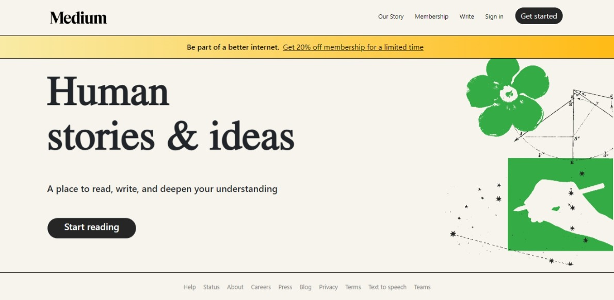
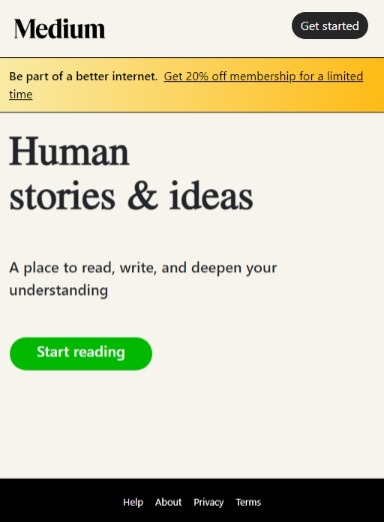

# Medium Landing Page (Duplicate) in React JS

## Overview

This project is part of the Codevixens Frontend Development Challenge (Day 3). The goal is a recreation of the Medium landing page, built using React. It showcases the use of components, styling, and responsive design principles.

## Features

- **Responsive Design**: The landing page adapts to different screen sizes, providing a consistent user experience across devices.
- **Hero Section**: A prominent hero section with engaging text and an illustrative image.
- **Navigation Bar**: A navigation bar with links to key Medium features.
- **Footer**: A footer with links to important resources and information.

## Installation

1. Clone the repository:

```bash
git clone https://github.com/gideonagyage/Medium-Landing-Page.git
```

2. Navigate to the project directory:

```bash
cd Medium-Landing-Page
```

3. Install dependencies:

```bash
npm install
```

## Usage

1. Start the development server:

```bash
npm start
```

2. Open your browser and navigate to

```bash
http://localhost:3000.
```

## What it entails

The landing page is built using React components, each responsible for a specific section of the page. The components are styled using Bootstrap and custom CSS to achieve the desired look and feel.

1. **MediumLandingPage**: The main component that renders the entire landing page.
2. **Header**: The navigation bar component, containing the Medium logo and navigation links.
3. **Footer**: The footer component, containing links to important resources and information.

## Screenshots

- On a large screen

<br>



- On a small screen

<br>



## Live Demo

Check out the live demo [here](https://medium-landing-page-six.vercel.app/).

## Reflection

This project helped me solidify my understanding of React components, styling with Bootstrap, and implementing responsive design principles. It was a fun and challenging experience to recreate a popular website like Medium.

## Contributing

Feel free to fork this repository and submit pull requests. Any contributions are welcome!

## License

This project is licensed under the MIT License.

## Acknowledgements

- Codevixens for organizing the challenge.
- Chinaza Igboanugo, Lois Bassey, and Oyinkansola Shoroye for their contributions and guidance.

Feel free to customize it further to fit your needs! If you have any specific details you'd like to add or change, let me know.
